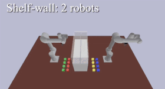
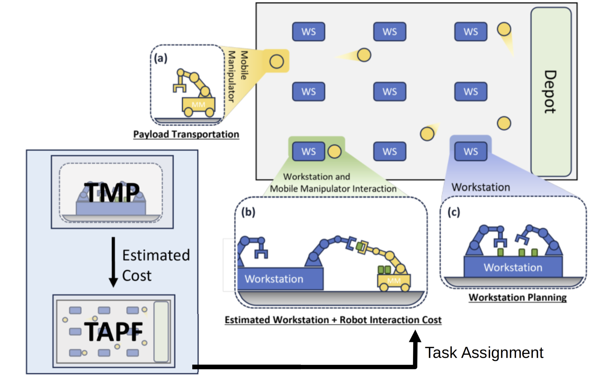
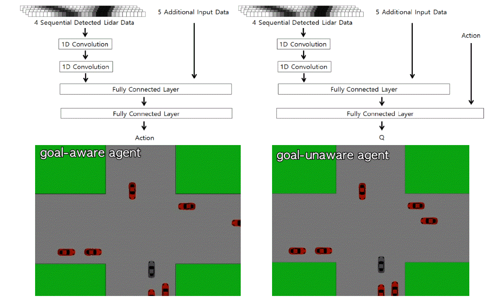
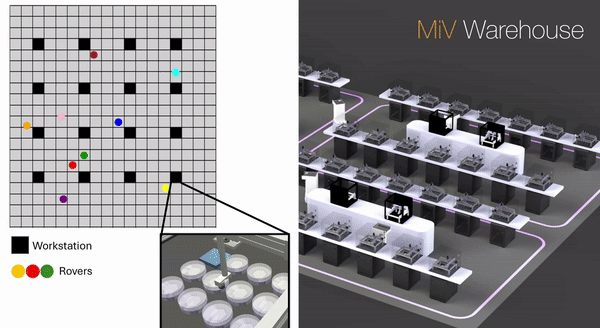
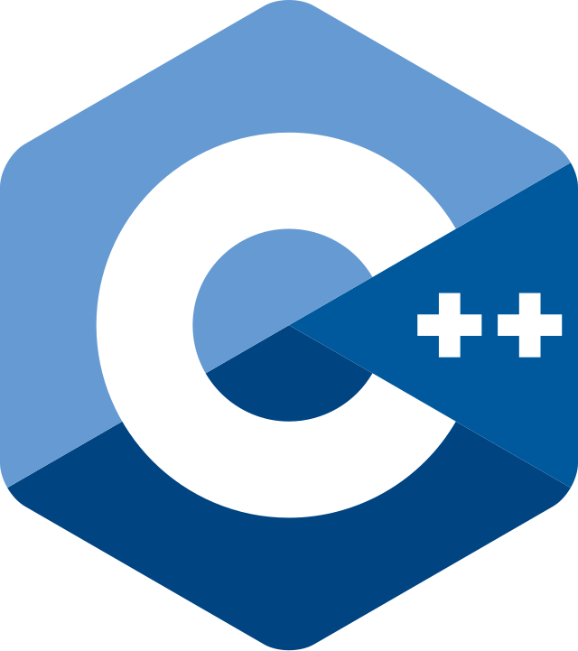
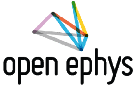
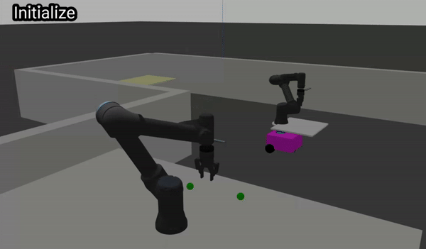
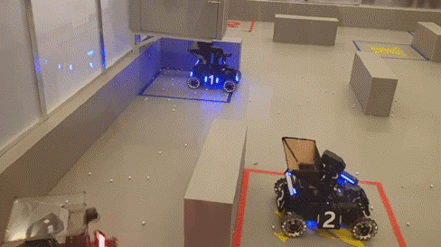


<header class="home-hero">
  
  

    <h1 class="home-hero-name">{{ author.name }}</h1>
    
Ph.D. Candidate &middot; Robotics University of Illinois Urbana-Champaign

    <ul class="home-hero-links">
      <li><a href="mailto:{{ author.email }}"><i class="fas fa-fw fa-envelope" aria-hidden="true"></i> Email</a></li>
      <li><a href="{{ author.googlescholar }}"><i class="ai ai-google-scholar" aria-hidden="true"></i> Google Scholar</a></li>
      <li><a href="https://www.linkedin.com/in/{{ author.linkedin }}"><i class="fab fa-fw fa-linkedin" aria-hidden="true"></i> LinkedIn</a></li>
      <li><a href="{{ link.url | relative_url }}"><i class="fas fa-fw fa-file-alt" aria-hidden="true"></i> Resume</a></li>
    </ul>
    
<mark>Open to full-time opportunities</mark> &middot; <a href="mailto:{{ author.email }}">Get in touch</a>

  

</header>

<aside class="demo-rail" aria-label="Interactive demo">
  <a class="demo-shortcut" href="https://sl148.github.io/reconfigurable-factory-demo/">
    Interactive demo &#8599;
    Reconfigurable LEGO <svg class="demo-lego-brick" viewBox="0 0 24 18" aria-hidden="true" focusable="false"><path fill="#b32624" d="M2 7h20v9H2z"/><path fill="#e4443e" d="M2 7l4-3h16v9l-4 3V7z"/><path fill="#f05a50" d="M2 7l4-3h16l-4 3z"/><path fill="#cf3530" d="M5 2h5v4H5zm9 0h5v4h-5z"/><ellipse cx="7.5" cy="2" rx="2.5" ry="1.3" fill="#f36a60"/><ellipse cx="16.5" cy="2" rx="2.5" ry="1.3" fill="#f36a60"/></svg> Factory
    <picture class="demo-preview">
      <source media="(prefers-reduced-motion: reduce)" srcset="{{ '/images/reconfigurable_factory_demo.png' | relative_url }}">
      
    </picture>
  </a>
</aside>

  
I study <strong>task and motion planning, multi-robot systems, and agentic systems</strong> with <a href="https://siebelschool.illinois.edu/about/people/all-faculty/namato">Nancy M. Amato</a> at UIUC&nbsp;.

  
Previously, as a Ph.D. Resident at <a href="https://x.company/">X, the Moonshot Factory</a>&nbsp;, I worked on wet-lab automation with robotics and multi-agent LLMs. I earned my bachelor&rsquo;s in Mechanical Engineering at Yonsei University&nbsp; (2021), advised by <a href="https://mlcs.yonsei.ac.kr/Professor.html">Jongeun Choi</a>.

<!-- News
------  -->

## Research

  <!-- ### Lazy-DaSH -->
  

    

    

      
Lazy-DaSH: Lazy Approach of Hypergraph-based Multi-robot Task and Motion Planning

      
<strong>Seongwon Lee</strong>, James Motes, Isaac Ngui, Marco Morales, Nancy M. Amato

      

        <a class="entry-venue" href="https://ieeexplore.ieee.org/xpl/RecentIssue.jsp?punumber=8860">IEEE Transactions on Robotics (T-RO), 2026</a>
        
          <a href="../files/lazy_hype_tro_arxiv.pdf">Paper</a>
          <a href="https://arxiv.org/abs/2504.05552">arXiv</a>
          <a href="../files/ICRA@40_poster.pdf">Poster</a>
          <a href="https://drive.google.com/file/d/1T53N-vW6U0LH1WA1w9WLaOhstgMNJTP8/view?usp=sharing">Simulation</a>
          <a href="https://drive.google.com/file/d/1fAJ8TNFg8BKuut13hG3sdsWv_wC8lJcw/view?usp=sharing">Hardware Exp.</a>
        
      

    

  

  <!-- ### Reconfigurable Factory -->
  

    

    

      
A Hierarchical Approach to Workstation-based Task Allocation and Motion Planning

      
<strong>Seongwon Lee</strong>, James Motes, Isaac Ngui, Marco Morales, Nancy M. Amato

      

        <a class="entry-venue" href="https://ieee-iros.org/">IROS 2023 Workshop</a>
        
          <a href="../files/RAFF_2023_Submission.pdf">Paper</a>
          <a href="../files/IROS2023Poster.pdf">Poster</a>
          <a href="https://sl148.github.io/reconfigurable-factory-demo/">Interactive Demo</a>
        
      

    

  

  <!-- ### Quadrotor -->
  

    

    

      
Output Feedback Control Design for Quadrotors Using Recursive Least Square Dynamic Inversion

      
<strong>Seongwon Lee</strong>, Joohwan Seo, Connor J. Boss, Joonho Lee, Jongeun Choi

      

        <a class="entry-venue" href="https://www.sciencedirect.com/journal/mechatronics">Elsevier Mechatronics</a>
        
          <a href="../files/Outputfeedbackcontroldesignforquadrotorusingrecursiveleast square dynamicinversion.pdf">Paper</a>
          <a href="https://youtu.be/ltcx1X3WuIU">YouTube</a>
        
      

    

  

  <!-- ### Helicopter -->
  

    

    

      
Nonaffine Helicopter Control Design and Implementation Based on a Robust Explicit Nonlinear Model Predictive Control

      
Joohwan Seo, <strong>Seongwon Lee</strong>, Joonho Lee, Jongeun Choi

      

        <a class="entry-venue" href="https://ieeexplore.ieee.org/xpl/RecentIssue.jsp?punumber=87">IEEE Transactions on Control Systems Technology</a>
        
          <a href="../files/NonaffineHelicopterControlDesignandImplementationBasedonaRobustExplicitNonlinearModelPredictiveControl.pdf">Paper</a>
          <a href="https://www.youtube.com/watch?v=aLQ-Ar9PMv4">YouTube</a>
        
      

    

  

  <!-- ### Driving -->
  

    

    

      
Unexpected Collision Avoidance Driving Strategy Using Deep Reinforcement Learning

      
Myunhoe Kim, <strong>Seongwon Lee</strong>, Jaehyun Lim, Jongeun Choi, Seong Gu Kang

      

        <a class="entry-venue" href="https://ieeexplore.ieee.org/xpl/RecentIssue.jsp?punumber=6287639">IEEE Access</a>
        
          <a href="../files/UnexpectedCollisionAvoidanceDrivingStrategyUsingDeepReinforcementLearning.pdf">Paper</a>
        
      

    

  

## Projects

  <!-- ### Reconfigurable LEGO Factory demo -->
  

    <a class="entry-thumb" href="https://sl148.github.io/reconfigurable-factory-demo/"><picture><source media="(prefers-reduced-motion: reduce)" srcset="{{ '/images/reconfigurable_factory_demo.png' | relative_url }}"></picture></a>
    

      Interactive demo
      
Reconfigurable LEGO Factory: Interactive Web Demo

      
An interactive 3D factory where multi-arm workcells assemble LEGO models while mobile manipulators fetch bricks, planned by a hierarchy of order assignment (MILP), multi-robot task planning and multi-arm motion planning. Configure a workcell's robot arms yourself, or watch the factory run with a live Gantt chart.

      

        <a class="entry-cta" href="https://sl148.github.io/reconfigurable-factory-demo/">Try the Demo</a>
      

    

  

  <!-- ### Driving -->
  

    

    

      <!-- 
In this section, provide details about your research on quadrotors, including any unique approaches, challenges, and achievements.
 -->
      
Mind in Vitro (MiV)

      
Developing an robotics automation system for a biology lab, funded by National Science Foundation (NSF)

      

        Skills
        <!-- ROS -->
        <!-- C++ -->
        <!-- Open Ephys -->
      

      

        <a href="https://mindinvitro.illinois.edu/">MiV</a>
      

    

  

  <!-- ### Driving -->
  

    

    

      <!-- 
In this section, provide details about your research on quadrotors, including any unique approaches, challenges, and achievements.
 -->
      
Factory Automation Demo

      
Demonstrated a simple factory automation demo to pre-college students at the Engineering Open House (EOH) at UIUC

      

        Skills
        <!-- ROS -->
        <!-- Python -->
        <!-- Universal Robot Arms -->
        <!-- Universal Robot Arms -->
      

      

        <a href="https://eohillinois.org/">EOH</a>
      

    

  

  <!-- ### Driving -->
  

    

    

      <!-- 
In this section, provide details about your research on quadrotors, including any unique approaches, challenges, and achievements.
 -->
      
Robotics Course Project: Handoff Operation for Mobile Manipulators

      
Designed a vision-based system for handoff operations between a workstation and a mobile manipulator

      

        Skills
        <!-- ROS -->
        <!-- Gazebo -->
        <!-- Python -->
      

      

        <a href="https://youtu.be/vK7W6ffZrBM">Youtube</a>
      

    

  

  <!-- ### Driving -->
  

    

    

      
Robomaster AI Challenge ICRA2019

      
Implemented cooperative planning algorithms for fully autonomous combat robots (Achieved 3rd place)

      

        Skills
        <!-- ROS -->
        <!-- Gazebo -->
        <!-- C++ -->
        <!-- Python -->
      

      

        
          <a href="https://www.robomaster.com/en-US">Robomaster AI Challenge</a>
          <a href="https://www.youtube.com/watch?v=oJdBfSafWjM">Youtube</a>
        
      

    

  

<!-- ### Driving -->
<!-- 

  

    
  

  

    <strong>BMW Korea Research Competition</strong> 
    Myunhoe Kim, Seongwon Lee, Jaehyun Lim, Jongeun Choi, Seong Gu Kang 
    <a href="https://ieeexplore.ieee.org/xpl/RecentIssue.jsp?punumber=6287639">[IEEE Access]</a> / <a href="https://icra40.ieee.org/">[Paper]</a> 
  

 -->

<!-- Experience
------ -->

## Professional Service

- **Reviewer**
  - RAL, ICRA, IROS, WAFR (2022 - 2024)
- **Teaching & Mentoring**
  - **Research Program Mentor (CS)**, UIUC – Fall 2023, Summer 2024, Spring 2024
  - **Fluid Mechanics (ME 310)**, UIUC – Fall 2022, Spring 2024, Fall 2024
  - **Mathematical Methods (TAM 541)**, UIUC – Fall 2021
{: .service-list}

<!-- Contact
------ 
More info about configuring Academic Pages can be found in [the guide](https://academicpages.github.io/markdown/), the [growing wiki](https://github.com/academicpages/academicpages.github.io/wiki), and you can always [ask a question on GitHub](https://github.com/academicpages/academicpages.github.io/discussions). The [guides for the Minimal Mistakes theme](https://mmistakes.github.io/minimal-mistakes/docs/configuration/) (which this theme was forked from) might also be helpful. -->
