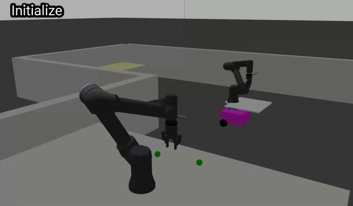

I am a Ph.D. student in [Mechanical Science and Engineering](https://mechse.illinois.edu/) Department at the [University of Illinois at Urbana-Champaign](https://illinois.edu/), co-advised by Professors [Nancy M. Amato](https://siebelschool.illinois.edu/about/people/all-faculty/namato) and [Geir E. Dullerud](https://mechse.illinois.edu/people/profile/dullerud). 

My research focuses on developing efficient <strong>multi-robot task and motion planning</strong> algorithms, enabling rapid adaptation to constraint-heavy environments. I have extensive experience integrating hardware and software for impactful real-world deployments.

I received my bachelor’s degree in Mechanical Engineering under the guidance of Professor [Jongeun Choi](https://mlcs.yonsei.ac.kr/Professor.html) from Yonsei University in Seoul, South Korea, in 2021.

I am looking for research internships for summer 2025.

<!-- News
------  -->

Research
------
<!-- ### Lazy-DaSH -->

  

    
  

  

    <!-- 
This section describes Lazy-DaSH, detailing the project, its goals, and any key results or publications.
 -->
    <strong>Lazy-DaSH: Lazy Approach of Hypergraph-based Multi-robt Task and Motion Planning</strong> 
    Seongwon Lee, James Motes, Isaac Ngui, Marco Morales, Nancy M. Amato 
    <a href="https://icra40.ieee.org/">[ICRA@40]</a> / <a href="../files/ICRA@40 Lazy-DaSH Lazy Approach for Hypergraph-based Multi-robot Task and Motion Planning Final.pdf">[Paper]</a> / <a href="../files/ICRA@40_poster.pdf">[Poster]</a>
  

<!-- ### Reconfigurable Factory -->

  

    
  

  

    <!-- 
This section describes the Reconfigurable Factory project. Include information on how it enables flexible manufacturing and any specific methodologies or technologies used.
 -->
    <strong>A hierarchical Approach to Workstation-based Task Allocation and Motion Planning</strong> 
    Seongwon Lee, James Motes, Isaac Ngui, Marco Morales, Nancy M. Amato 
    <a href="https://ieee-iros.org/">[IROS 2023 Workshop]</a> / <a href="../files/RAFF_2023_Submission.pdf">[Paper]</a> / <a href="../files/IROS2023Poster.pdf">[Poster]</a>
  

<!-- ### Quadrotor -->

  

    
  

  

    <!-- 
This section provides an overview of the driving research. Describe any experiments, models, or insights gained in this area.
 -->
    <strong>Output Feedback Control Design for Quadrotors Using Recursive Least Square Dynamic Inversion</strong> 
    Seongwon Lee, Joohwan Seo, Connor J. Boss, Joonho Lee, Jongeun Choi 
    <a href="https://www.sciencedirect.com/journal/mechatronics">[Elsevir Mechatronics]</a> / <a href="../files/Outputfeedbackcontroldesignforquadrotorusingrecursiveleast square dynamicinversion.pdf">[Paper]</a> / <a href="https://youtu.be/ltcx1X3WuIU">[Youtube]</a>
  

<!-- ### Helicopter -->

  

    
    <!-- <video controls style="max-width: 100%; height: auto;">
      <source src="../images/helicopter.mp4" type="video/mp4">
      Your browser does not support the video tag.
    </video> -->
  

  

    <!-- 
This section provides an overview of the driving research. Describe any experiments, models, or insights gained in this area.
 -->
    <strong>Nonaffine helicopter control design and implementation based on a robust explicit nonlinear model predictive control</strong> 
    Joohwan Seo, Seongwon Lee, Joonho Lee, Jongeun Choi 
    <a href="https://ieeexplore.ieee.org/xpl/RecentIssue.jsp?punumber=87">[IEEE Transactions on Control Systems Technology]</a> / <a href="../files/NonaffineHelicopterControlDesignandImplementationBasedonaRobustExplicitNonlinearModelPredictiveControl.pdf">[Paper]</a> / <a href="https://www.youtube.com/watch?v=aLQ-Ar9PMv4">[Youtube]</a>
  

<!-- ### Driving -->

  

    
  

  

    <!-- 
In this section, provide details about your research on quadrotors, including any unique approaches, challenges, and achievements.
 -->
    <strong>Unexpected Collision Avoidance Driving Strategy Using Deep Reinforcement Learning</strong> 
    Myunhoe Kim, Seongwon Lee, Jaehyun Lim, Jongeun Choi, Seong Gu Kang 
    <a href="https://ieeexplore.ieee.org/xpl/RecentIssue.jsp?punumber=6287639">[IEEE Access]</a> / <a href="../files/UnexpectedCollisionAvoidanceDrivingStrategyUsingDeepReinforcementLearning.pdf">[Paper]</a> 
  

Projects
------

<!-- ### Driving -->

  

    
  

  

    <!-- 
In this section, provide details about your research on quadrotors, including any unique approaches, challenges, and achievements.
 -->
    <strong>Mind in Vitro (MiV)</strong> 
    Developing an robotics automation system for a biology lab, funded by National Science Foundation (NSF) 
    

      <strong>Skills:</strong>
      

        
        ROS
      

      

        
        C++
      

      

        
        Open Ephys
      

    

    <a href="https://mindinvitro.illinois.edu/">[MiV]</a> 
  

<!-- ### Driving -->

  

    
  

  

    <!-- 
In this section, provide details about your research on quadrotors, including any unique approaches, challenges, and achievements.
 -->
    <strong>Factory Automation Demo</strong> 
    Demonstrated a simple factory automation demo to pre-college students at the Engineering Open House (EOH) at UIUC 
    

      <strong>Skills:</strong>
      

        
        ROS
      

      

        
        Universal Robot Arms
      

      

        
        Python
      

    

    <a href="https://eohillinois.org/">[EOH]</a>
  

<!-- ### Driving -->

  

    
  

  

    <!-- 
In this section, provide details about your research on quadrotors, including any unique approaches, challenges, and achievements.
 -->
    <strong>Robotics Course Project: Handoff Operation for Mobile Manipulators</strong> 
    Designed a vision-based system for handoff operations between a workstation and a mobile manipulator  
    

      <strong>Skills:</strong>
      

        
        ROS
      

      

        
        Gazebo
      

      

        
        Python
      

    

    <a href="https://youtu.be/vK7W6ffZrBM">[Youtube]</a> 
  

<!-- ### Driving -->

  

    
  

  

    <strong>Robomaster AI Challenge ICRA2019</strong> 
    Implemented cooperative planning algorithms for fully autonomous combat robots (Achieved 3rd place)  
    

      <strong>Skills:</strong>
      

        
        ROS
      

      

        
        Gazebo
      

      

        
        C++
      

        
        Python
      

    

    <a href="https://www.robomaster.com/en-US">[Robomaster AI Challenge]</a> / <a href="https://www.youtube.com/watch?v=oJdBfSafWjM">[Youtube]</a> 
  

<!-- ### Driving -->
<!-- 

  

    
  

  

    <strong>BMW Korea Research Competition</strong> 
    Myunhoe Kim, Seongwon Lee, Jaehyun Lim, Jongeun Choi, Seong Gu Kang 
    <a href="https://ieeexplore.ieee.org/xpl/RecentIssue.jsp?punumber=6287639">[IEEE Access]</a> / <a href="https://icra40.ieee.org/">[Paper]</a> 
  

 -->

<!-- Experience
------ -->

Professional Service
------
- **Reviewer**
  - ICRA, IROS, WAFR (2022 - 2024)

- **Teaching & Mentoring**
  - **Research Program Mentor (CS)**, UIUC – Fall 2023, Summer 2024, Spring 2024
  - **Fluid Mechanics (ME 310)**, UIUC – Fall 2022, Spring 2024, Fall 2024
  - **Mathematical Methods (TAM 541)**, UIUC – Fall 2021

<!-- Contact
------ 
More info about configuring Academic Pages can be found in [the guide](https://academicpages.github.io/markdown/), the [growing wiki](https://github.com/academicpages/academicpages.github.io/wiki), and you can always [ask a question on GitHub](https://github.com/academicpages/academicpages.github.io/discussions). The [guides for the Minimal Mistakes theme](https://mmistakes.github.io/minimal-mistakes/docs/configuration/) (which this theme was forked from) might also be helpful. -->
